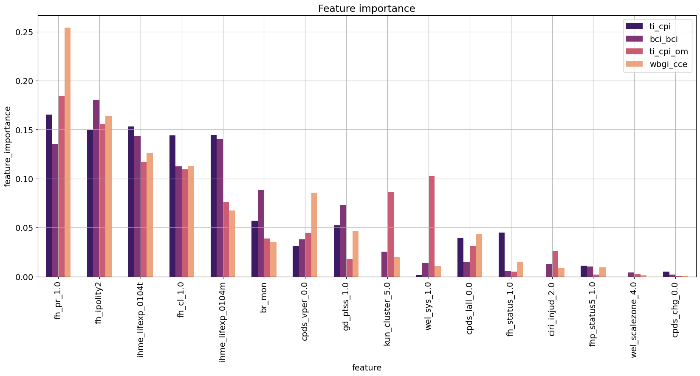
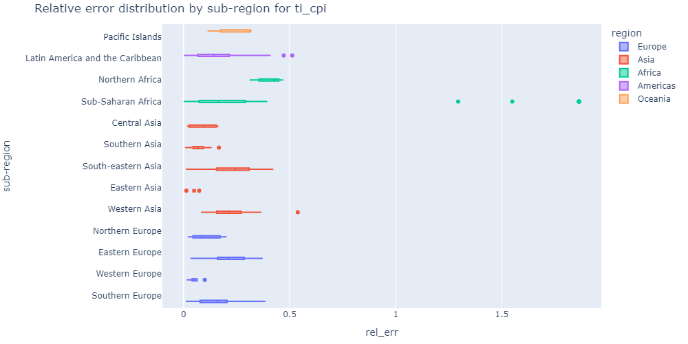
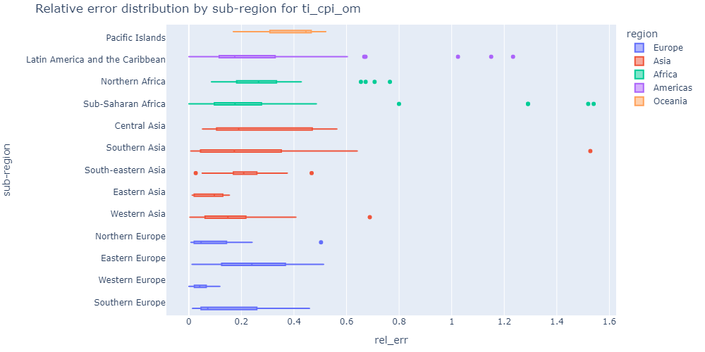
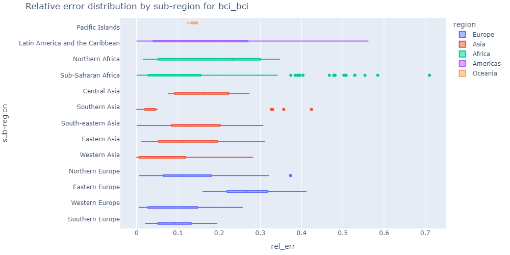
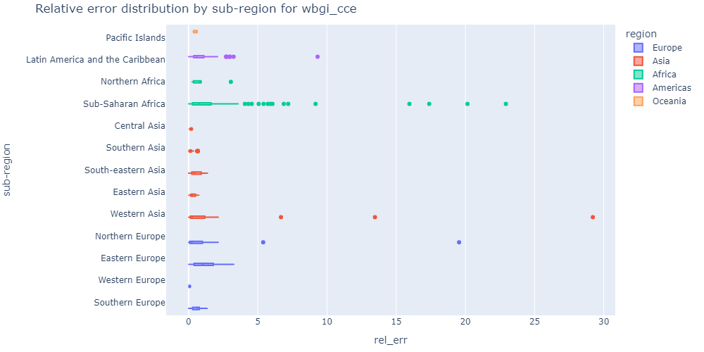

# Corruption
## Group 21: Godun, Haberger, Haberl, Konzett

To answer the following question on the topic of corruption a model trained on the [QoG (Quality of Governence) Standard Time-Series Dataset](https://www.gu.se/en/quality-government/qog-data/data-downloads/standard-dataset) was created and analyzed: 

- Which country’s characteristics are good predictors of a country’s position on a corruption index?

- Are there countries whose characteristics don’t correspond to their position on a corruption index?

- If yes, does this hold across all corruption indexes, or do the lists of such countries vary from index to index?

### Characteristics

In the plot above the most important country characteristics for corruption prediction are shown in decreasing order of importance.
The most important features can be categorized in the following way:
- __political freedom__: "fh_pr_1.0", "fh_ipolity2", "br_mon", "cpds_vper_0.0", "wel_sys_1.0", "fh_status_1.0", 
- __Life expectency__: "ihme_lifexp_0104t", ihme_lifexp_0104m
- __civil liberties__: "gd_ptss_1.0", "fh_cl_1.0 "

### Difference between countries across models

The models performed equally good for different countries across the regions. Across the sub-regions there was a difference in model performandce, but only small number of interesting connections held across different models:
- Bigger spread, right shift and higher values in the box plots belows signify worse performance
- All models performed worse for Eastern Europe region, which might suggest that the corruption index was estimated incorrectly for those countries.
- All models had the worst performance for countries from Sub-Sahara Africa region, but the countries were different in different models, which implies that there is no mismatch between predictor variables and corruption index.
- Multiple models (ti_cpi_om, wbgi_cce) had a problem with Latvia from the beginning of 2000s, which might imply that the corruption indices were not estimated correctly.

    

    
     
    
     
    

